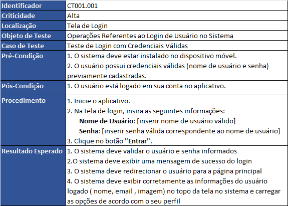
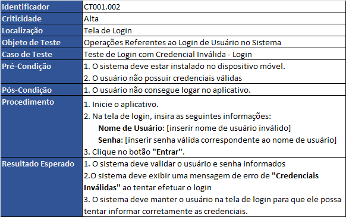
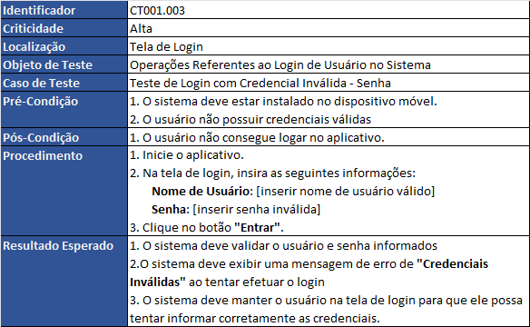
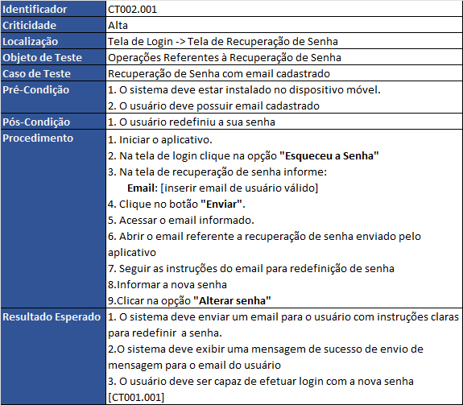
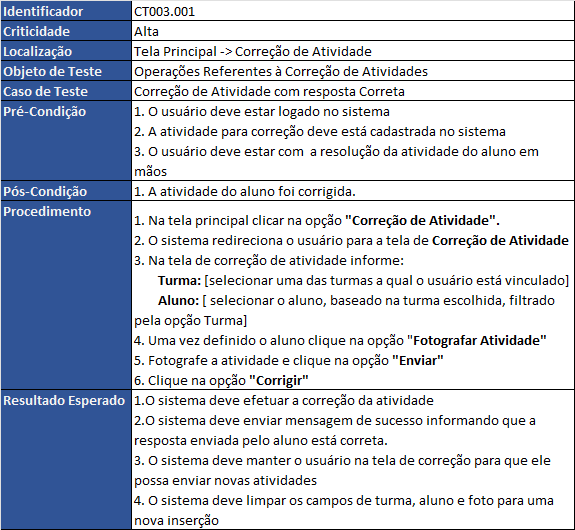

# Roteiro de Testes - Aplicativo de Ensino de Matemática
| **Informações**            |  |
|------------------------|-------------------|
| **Projeto**            | Ensino Matemática |
| **Autor**              | Italo Carlo       |
| **Versão**             | 0.10              |
| **Última Atualização** | 08/10/2023        |

## Introdução
 
O processo de teste de software desempenha um papel crucial no ciclo de desenvolvimento de software. Através de testes rigorosos, podemos detectar e corrigir erros, garantir a estabilidade do sistema e assegurar que o aplicativo atenda às expectativas dos usuários. Cada caso de teste incluído neste roteiro contribui para a validação do aplicativo, assegurando que ele funcione de acordo com as especificações e proporcionando uma experiência confiável aos usuários.

## Objetivos
 
 Este documento tem como objetivo fornecer um guia abrangente para a avaliação dos aspectos funcionais deste aplicativo dedicado ao ensino e aprendizado da disciplina de matemática

 ## Escopo
 
 Este roteiro de testes contempla somente aspectos funcionais da aplicação, ou seja, tudo que se refere aos requisitos funcionais especificados pelo engenheiro de requisitos. Os aspectos não-funcionais ou de qualidade serão cobertos em um outro roteiro específico. Ademais, foi levado em consideração que somente o professor tem acesso a este aplicativo. Esta decisão levou em consideração a visão geral da aplicação onde some o nome do professor é exibido junto ao aplicativo

 ## Estrutura dos Casos de Testes

 Cada caso de teste apresentado neste roteiro seguirá a estrutura descrita a seguir:

 | Item      | Descrição                                           |
|--------------------|---------------------------------------------------------------------------------------|
| **Identificador**        | Código Único que identifica o caso de teste     |
| **Criticidade**        | Define a importância de cada caso de teste em relação a funcionalidade do sistema     |
| **Localização**        | Define em qual tela que podemos realizar o caso de teste                              |
| **Objeto de Teste**    | Ideia global de um conjunto de Casos de Teste                                                                            |
| **Caso de Teste**      | Descrição da ideia principal do Caso de Teste                                         |
| **Pré-Condição**       | é o requisito para o comportamento do sistema antes de executar o caso de teste       |
| **Pós-Condição**       | é o requisito para o comportamento do sistema após a execução do caso de teste        |
| **Procedimento**       | São os passos necessários para a realização do caso de teste                          |
| **Resultado Esperado** | descreve como deveria ser o comportamento do sistema após a execução do caso de teste |

A identificação de cada caso de teste seguiu um padrão de codificação: CT999.000. Abaixo segue a definição de cada um destes itens:

 | Item      | Descrição                                           |
|--------------------|---------------------------------------------------------------------------------------|
| **CT**        | Pré-fixo de caso de teste     |
| **999**        | deve ser numérico e define o grupo do caso de teste     |
| **000**        | deve ser numérico e define o número sequencial do caso de teste dentro do grupo do caso. Deve ser único                              |

Para uma organização mais eficiente dos casos de teste, realizamos uma subdivisão em cinco grupos, os quais estão detalhadamente descritos a seguir:

| Grupo      | Descrição                                           |
|--------------------|---------------------------------------------------------------------------------------|
| **001**        | Casos de testes referentes ao Login de Usuário     |
| **002**        | Casos de testes referentes à Recuperação de Senha     |
| **003**        | Casos de testes referentes à Correção de Atividades|
| **004**        | Casos de testes referentes à Lista de Atividades|
| **005**        | Casos de testes referentes à Agrupamento de Alunos|

Com relação a criticidade foram definidos três níveis: Alto, Médio e Baixo. Elas foram atribuídas a cada um dos casos de testes de acordo com importância da operação dentro do sistema.

 | Criticidade      | Descrição                                           |
|--------------------|---------------------------------------------------------------------------------------|
| **Alta**        | verificam funcionalidades críticas, requisitos essenciais e áreas de alto risco no aplicativo.     |
| **Média**        | verificam funcionalidades importantes, mas podem não ser críticos para o sucesso imediato do projeto. Eles geralmente abordam funcionalidades secundárias ou requisitos menos críticos.|
| **Baixa**        |  verificam funcionalidades periféricas, recursos opcionais ou requisitos que têm baixa importância.                              |

## Casos de Testes

### Casos de Testes de Login 

### Casos de Testes de Recuperação de Senha

### Casos de Testes de Correção de Atividade

### Casos de Testes de Listas de Atividades

### Casos de Testes de Agrupamento de Alunos

