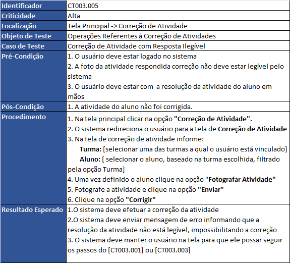

# Roteiro de Testes - Aplicativo de Ensino de Matemática
| **Informações**            |  |
|------------------------|-------------------|
| **Projeto**            | APP_Simple_Math |
| **Autor**              | Italo Carlo       |
| **Versão**             | 0.10              |
| **Última Atualização** | 08/10/2023        |

## Introdução
 
O processo de teste de software desempenha um papel crucial no ciclo de desenvolvimento de software. Através de testes rigorosos, podemos detectar e corrigir erros, garantir a estabilidade do sistema e assegurar que o aplicativo atenda às expectativas dos usuários. Cada caso de teste incluído neste roteiro contribui para a validação do aplicativo, assegurando que ele funcione de acordo com as especificações e proporcionando uma experiência confiável aos usuários.

## Objetivos
 
 Este documento tem como objetivo fornecer um guia abrangente para a avaliação dos aspectos funcionais deste aplicativo dedicado ao ensino e aprendizado da disciplina de matemática

 ## Escopo
 
 Este roteiro de testes contempla somente aspectos funcionais da aplicação, ou seja, tudo que se refere aos requisitos funcionais especificados pelo engenheiro de requisitos. Os aspectos não-funcionais ou de qualidade serão cobertos em um outro roteiro específico. Ademais, foi levado em consideração que somente o professor tem acesso a este aplicativo. Esta decisão levou em consideração a visão geral da aplicação onde somente o nome do professor é exibido junto ao aplicativo

 ## Tipo de Teste
 
 Este roteiro pode ser classificado como um teste caixa preta, onde o testador não precisa conhecer os detalhes da implementação. Baseia-se nos requisitos básicos do software, sendo o foco nos requisitos da aplicação, ou seja, nas ações que deve desempenhar. Se resumem em testes de entrada e saída.

 ## Modo de Operação
 
 Este roteiro foi concebido para ser executado manualmente pelos testadores. Com o intuito de evitar qualquer viés nos resultados os desenvolvedores da aplicação não devem estar envolvidos na sua execução.

 ## Conjunto de Dados para os Testes

 Esta seção vai descrever os dados que deve estar no sistema antes da execução e ao final dele. Vale ressaltar que a cada nova execução do roteiro a base de teste de ser inicializada com os dados pré-cadastrados. O conjunto de dados pode sofrer alteração a medida que este roteiro de teste for atualizado. Outro ponto importante que não é objetivo desta seção destacar todas colunas das tabelas e sim permitir que o testador tem uma visão geral das informações, bem como do relacionamento entre elas.
 
 ### Dados Pré-Cadastrados

 Abaixo segue o conjunto de dados que deve estar cadastrado na base de teste antes da execução do roteiro, são eles:
 #### Usuários
 |ID |Nome              | Email             | Login   | Senha  | Perfil   |
 |---|------------------|-------------------|---------|--------|----------|
 | 1 | **João da Silva**| joao@professor.com| joao123 | 123456 | Professor| 
 | 2 | **Pedro José**   | pedro@professor.com| pedro123 | 123456 | Professor| 

 #### Turmas
 |ID |Descrição         | Professor             | 
 |---|------------------|-------------------|
 | 1 | **A**| 1| 
 | 2 | **B**| 1| 
 | 3 | **C**| 2| 

 #### Alunos
 |ID |Nome              | Turma             | 
 |---|------------------|-------------------|
 | 1 | **Paulo André**| 1|
 | 2 | **Sofia Andrade**| 1|
 | 3 | **Pedro Paulino**| 1|
 | 4 | **Amanda Silva**| 2|
 | 5 | **Mayara Lopes**| 2|
 | 6 | **João Guimarães**| 2|
 | 7 | **Isabelle Figueredo**| 3|
 | 8 | **Marcos Leão**| 3|
 | 9 | **Noah Oliveira**| 3|

 #### Categorias de Questões
 
 |ID |Descrição         | 
 |---|------------------|
 | 1 | **Resolução de equações e sistemas de equações**|
 | 2 | **Teorema de Pitágoras e trigonometria**|
 
 
 #### Atividades
 |ID |Descrição              | Categoria             | 
 |---|------------------|-------------------|
 | 1 | **Resolução de Equação Linear**| 1|
 | 2 | **Resolução de Equação Linear-2**| 1|
 | 3 | **Resolução de Equação Quadrática**| 1|
 | 4 | **Resolução de Equação Quadrática-2**| 1|
 | 5 | **Resolução de Equação Quadrática-3**| 1|
 | 6 | **Sistema de Equações Lineares:**| 1|
 | 7 | **Sistema de Equações Lineares-2:**| 1|
 | 8 | **Sistema de Equações Lineares-3:**| 1|
 | 9 | **Sistema de Equações Quadráticas:**| 1|
 | 10 | **Resolução de Equação Linear**| 1|
 | 11 | **Teorema de Pitágoras - Encontrando um Lado**| 2|
 | 12 | **Teorema de Pitágoras - Encontrando um Lado-2**| 2|
 | 13 | **Teorema de Pitágoras - Encontrando um Lado-3**| 2|
 | 14 | **Teorema de Pitágoras - Verificando Triângulos Retângulos**| 2|
 | 15 | **Teorema de Pitágoras - Verificando Triângulos Retângulos-2**| 2|
 | 16 | **Teorema de Pitágoras - Verificando Triângulos Retângulos-3**| 2|
 | 17 | **Trigonometria - Cálculo de Ângulos:**| 2|
 | 18 | **Trigonometria - Cálculo de Ângulos-2:**| 2|
 | 19 | **Trigonometria - Cálculo de Ângulos-3:**| 2|
 | 20 | **Trigonometria - Cálculo de Ângulos-4**| 2|

 ### Dados para Cadastrar durante a execução

 #### Correção de Atividades

 As informações abaixo serão disponibilizadas de Forma Impressa para que o testador possar utilizar o recurso de fotografia durante a correção. O testador deve verificar se o sistema vai se comportar corretamente no que se refere a verificação da resposta da atividade.

   |Atividade | Aluno |Cadastrada | Correta |Legível |
   |----------|-------|---------|-----------|--------|
   |1 | 1 | Sim | Sim | Sim |
   |3 | 1 | Sim |Sim |Sim |
   |5 | 1 | Sim |Sim |Sim |
   |21 | 1 | Não |Não |Sim |
   |11 | 1 | Sim |Sim |Sim |
   |12 | 1 | Sim |Sim |Sim |
   |13 | 1 | Sim |Sim |Sim |
   |2 | 2 | Sim |Sim |Sim |
   |3 | 2 | Sim |Sim |Sim |
   |8 | 2 | Sim |Sim |Sim |
   |12 | 2 | Sim |Sim |Sim |
   |14 | 2 | sim |Não |Sim |
   |18 | 2 | Sim |Não |Sim |
   |5 | 3 | Sim |Sim |Sim |
   |9 | 3 | Sim |Não |Sim |
   |10 | 3 | Sim |Não |Sim |
   |12 | 3 | Sim |Sim |Sim |
   |16 | 3 | Sim |Não |Sim |
   |17 | 3 | Sim |Não |Sim |
   |2 | 4 | Sim | Não |Sim |
   |8 | 4 | Sim |Não |Sim |
   |9 | 4 | Sim |Não |Sim |
   |11 | 4 | Sim |Sim |Sim |
   |12 | 4 | Sim |Sim |Sim |
   |13 | 4 | Sim |Sim |Sim |
   |1 | 5 | Sim |Sim |Sim |
   |4 | 5 | Sim |Sim |Sim |
   |5 | 5 | Sim |Sim |Sim |
   |11 | 5 | Sim |Sim |Sim |
   |16 | 5 | Sim |Sim |Sim |
   |20 | 5 | Sim |Sim |Sim |
   |2 | 6 | Sim |Sim |Sim |
   |4 | 6 | Sim |Sim |Sim |
   |9 | 6 | Sim |Sim |Sim |
   |12 | 6 | Sim |Sim |Sim |
   |16 | 6 | Sim |Sim |Sim |
   |17 | 6 | Sim |Sim |Sim |
   |1 | 7 | Sim | Não |Sim |
   |2 | 7 | Sim |Sim |Sim |
   |10 | 7 | Sim |Não |Sim |
   |14 | 7 | Sim |Não |Sim |
   |15 | 7 | Sim |Não |Sim |
   |19 | 7 | Sim |Não |Sim |
   |22 | 1 | Não |Não |Sim |
   |2 | 8 | Sim |Sim |Sim |
   |8 | 8 | Sim |Sim |Sim |
   |10 | 8 | Sim |Sim |Sim |
   |11 | 8 | Sim |Sim |Sim |
   |17 | 8 | Sim |Sim |Sim |
   |20 | 8 | Sim |Sim |Sim |
   |4 | 9 | Sim |Sim |Sim |
   |6 | 9| Sim |Sim |Sim |
   |7 |9 | Sim |Sim |Sim |
   |13 | 9| Sim |Sim |Sim |
   |16 | 9 | Sim |Não |Sim |
   |18 | 9 | Sim |Não |Sim |

Estes devem ser os resultados esperados após as correções das atividades
#### Lista de Atividades
|Aluno | Tem Lista |Grupos |   
|----------|-------|-------|
|1 | Não | - |
|2 | Sim | 2 |
|3 | Sim | 1 e 2 |
|4 | Sim | 2 |
|5 | Não | - |
|6| Não | - |
|7 | Sim | 1 e 2 |
|8 | Não | - |
|9 | Sim | 2 |

#### Agrupamento de Alunos
|ID |Grupo | Alunos|   
|---|-------|-------|
|1 | Alunos com dificuldades no Tópicos 1 e 2| 3 e 7 |
|1 | Alunos com dificuldades no Tópicos 2| 2,3,4, 7, 9 |

 ## Estrutura dos Casos de Testes

 Cada caso de teste apresentado neste roteiro seguirá a estrutura descrita a seguir:

 | Item      | Descrição                                           |
|--------------------|---------------------------------------------------------------------------------------|
| **Identificador**        | Código Único que identifica o caso de teste     |
| **Criticidade**        | Define a importância de cada caso de teste em relação a funcionalidade do sistema     |
| **Localização**        | Define em qual tela que podemos realizar o caso de teste                              |
| **Objeto de Teste**    | Ideia global de um conjunto de Casos de Teste                                                                            |
| **Caso de Teste**      | Descrição da ideia principal do Caso de Teste                                         |
| **Pré-Condição**       | é o requisito para o comportamento do sistema antes de executar o caso de teste       |
| **Pós-Condição**       | é o requisito para o comportamento do sistema após a execução do caso de teste        |
| **Procedimento**       | São os passos necessários para a realização do caso de teste                          |
| **Resultado Esperado** | descreve como deveria ser o comportamento do sistema após a execução do caso de teste |

A identificação de cada caso de teste seguiu um padrão de codificação: CT999.000. Abaixo segue a definição de cada um destes itens:

 | Item      | Descrição                                           |
|--------------------|---------------------------------------------------------------------------------------|
| **CT**        | Pré-fixo de caso de teste     |
| **999**        | deve ser numérico e define o grupo do caso de teste     |
| **000**        | deve ser numérico e define o número sequencial do caso de teste dentro do grupo do caso. Deve ser único                              |

Para uma organização mais eficiente dos casos de teste, realizamos uma subdivisão em cinco grupos, os quais estão detalhadamente descritos a seguir:

| Grupo      | Descrição                                           |
|--------------------|---------------------------------------------------------------------------------------|
| **001**        | Casos de testes referentes ao Login de Usuário     |
| **002**        | Casos de testes referentes à Recuperação de Senha     |
| **003**        | Casos de testes referentes à Correção de Atividades|
| **004**        | Casos de testes referentes à Lista de Atividades|
| **005**        | Casos de testes referentes à Agrupamento de Alunos|

Com relação a criticidade foram definidos três níveis: Alto, Médio e Baixo. Elas foram atribuídas a cada um dos casos de testes de acordo com importância da operação dentro do sistema.

 | Criticidade      | Descrição                                           |
|--------------------|---------------------------------------------------------------------------------------|
| **Alta**        | verificam funcionalidades críticas, requisitos essenciais e áreas de alto risco no aplicativo.     |
| **Média**        | verificam funcionalidades importantes, mas podem não ser críticos para o sucesso imediato do projeto. Eles geralmente abordam funcionalidades secundárias ou requisitos menos críticos.|
| **Baixa**        |  verificam funcionalidades periféricas, recursos opcionais ou requisitos que têm baixa importância.                              |

## Casos de Testes

### Casos de Testes de Login 

### Casos de Testes de Recuperação de Senha

### Casos de Testes de Correção de Atividade

### Casos de Testes de Listas de Atividades

### Casos de Testes de Agrupamento de Alunos

